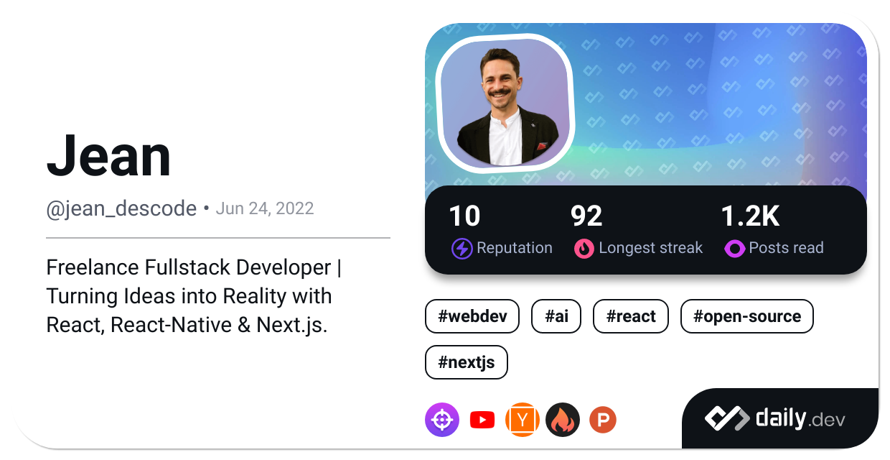

<h3 align="center">
⬇️ Check out my links! ⬇️
</h3>

 

 

## My skills 🚀

### 👅 Languages

### 🧰 Frameworks and libraries

### 📱 UI

### ⚙️ Backend

### 🗄 Databases

### 🖥️ Environment

### 📈 Project Management

